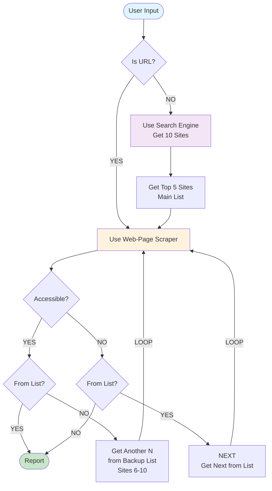

# Web Scraping Automation System - Software Creation Guide

## Overview
This document provides a comprehensive guide for building an automated web scraping system that can process either direct URLs or search queries, with intelligent fallback mechanisms and accessibility handling.

## System Flow Diagram



## System Architecture

### Core Components

#### 1. Input Handler
**Purpose**: Parse and validate user input

**Responsibilities**:
- Detect if input is a URL or search query
- Validate URL format (if URL)
- Sanitize search query (if not URL)
- Set initial processing mode

**Key Functions**:
- `parse_input(raw_input: string) -> InputType`
- `is_valid_url(input: string) -> boolean`
- `sanitize_query(input: string) -> string`

---

#### 2. Search Engine Module
**Purpose**: Retrieve search results when input is not a URL

**Responsibilities**:
- Query search engine API/service
- Retrieve exactly 10 results
- Extract URLs from results
- Return structured list of URLs

**Key Functions**:
- `search(query: string) -> list[URL]`
- `extract_urls(results: SearchResults) -> list[URL]`
- `get_top_n(results: list[URL], n: int) -> list[URL]`

**Configuration**:
- Search engine API endpoint
- API keys/credentials
- Result limit (10)
- Timeout settings

---

#### 3. List Manager
**Purpose**: Manage main and backup URL lists

**Responsibilities**:
- Split 10 URLs into Main List (1-5) and Backup List (6-10)
- Track current position in lists
- Provide next URL from appropriate list
- Detect when backup list is exhausted

**Key Functions**:
- `initialize_lists(urls: list[URL]) -> (main_list, backup_list)`
- `get_next_from_main() -> URL | None`
- `get_next_from_backup() -> URL | None`
- `is_backup_exhausted() -> boolean`
- `is_from_list(url: URL) -> boolean`

**State Management**:
- Main list index pointer
- Backup list index pointer
- Original URL tracking (for single URL mode)

---

#### 4. Web Scraper
**Purpose**: Fetch and extract content from URLs

**Responsibilities**:
- Make HTTP requests with proper headers
- Handle different content types (HTML, JSON, XML, etc.)
- Extract relevant data based on selectors/patterns
- Handle redirects and encoding
- Return structured content

**Key Functions**:
- `scrape(url: URL) -> ScrapedContent`
- `extract_data(html: string, selectors: dict) -> dict`
- `parse_content(response: HTTPResponse) -> ParsedContent`

**Configuration**:
- User-Agent string
- Request timeout
- Max retries
- Content extraction rules/selectors

---

#### 5. Accessibility Checker
**Purpose**: Verify if URL is accessible

**Responsibilities**:
- Check HTTP status codes (200, 301, 302 = accessible)
- Handle timeouts
- Detect blocked/forbidden access (403, 404, 500+)
- Detect connection errors
- Return boolean accessible status

**Key Functions**:
- `check_accessibility(url: URL) -> boolean`
- `is_valid_status(status_code: int) -> boolean`
- `handle_error(error: Error) -> AccessibilityResult`

**Success Criteria**:
- Status code 2xx or 3xx
- Response received within timeout
- No connection errors

**Failure Criteria**:
- Status code 4xx or 5xx
- Timeout exceeded
- Connection refused/reset
- SSL/TLS errors

---

#### 6. Report Generator
**Purpose**: Compile and format final output

**Responsibilities**:
- Aggregate all successfully scraped data
- Format output (JSON, CSV, HTML, Markdown, etc.)
- Include metadata (timestamp, source URLs, status)
- Handle empty/failed scrapes gracefully
- Generate summary statistics

**Key Functions**:
- `generate_report(scraped_data: list[ScrapedContent]) -> Report`
- `format_output(data: dict, format: OutputFormat) -> string`
- `add_metadata(report: Report) -> Report`
- `calculate_statistics(data: list) -> Stats`

**Output Includes**:
- Successfully scraped content
- Source URL for each content
- Timestamp of scraping
- Total URLs attempted
- Success/failure count
- Failed URLs list

---

## Data Structures

### 1. Input Object
```
{
  raw_input: string,
  type: "URL" | "QUERY",
  is_valid: boolean
}
```

### 2. URL List
```
{
  main_list: [URL1, URL2, URL3, URL4, URL5],
  backup_list: [URL6, URL7, URL8, URL9, URL10],
  main_index: int,
  backup_index: int
}
```

### 3. Scrape Result
```
{
  url: string,
  content: string | object,
  status: "success" | "failed",
  accessible: boolean,
  timestamp: datetime,
  error_message: string | null
}
```

### 4. Report
```
{
  query: string,
  total_urls: int,
  successful_scrapes: int,
  failed_scrapes: int,
  results: [ScrapeResult],
  failed_urls: [string],
  generated_at: datetime
}
```

---

## Implementation Flow

### Phase 1: Input Processing

**Step 1.1**: Receive user input
- Accept input from CLI, API, or UI
- Store raw input string

**Step 1.2**: Determine input type
- Use regex to check if input matches URL pattern
- Patterns to check:
  - `http://` or `https://` prefix
  - Valid domain structure
  - TLD validation

**Step 1.3**: Branch logic
- If URL: Set mode to "SINGLE_URL" → proceed to Phase 3
- If Query: Set mode to "MULTI_URL" → proceed to Phase 2

---

### Phase 2: Search and List Creation (Multi-URL Mode Only)

**Step 2.1**: Execute search
- Call search engine API with query
- Set result limit to 10
- Handle search errors:
  - API timeout → retry with backoff
  - Invalid query → return error to user
  - No results → return empty report

**Step 2.2**: Process search results
- Extract URLs from search results
- Validate each URL format
- Remove duplicates
- Ensure exactly 10 results (or fewer if unavailable)

**Step 2.3**: Split into lists
- Assign URLs 1-5 to Main List
- Assign URLs 6-10 to Backup List
- Initialize index pointers to 0

---

### Phase 3: Scraping Loop

**Step 3.1**: Get next URL
- If first iteration and SINGLE_URL mode: use provided URL
- If MULTI_URL mode: get next from Main List
- Mark current URL source (main list, backup list, or single)

**Step 3.2**: Attempt scraping
- Call web scraper with current URL
- Set appropriate timeout (e.g., 30 seconds)
- Capture response or error

**Step 3.3**: Check accessibility
- Evaluate HTTP status code
- Check for connection errors
- Determine if URL is accessible (boolean)

**Step 3.4**: Determine next action based on accessibility and source

**Case A: Accessible + From List**
- ✓ Content successfully scraped
- → Generate Report and EXIT

**Case B: Accessible + NOT From List**
- ✓ Content successfully scraped from backup
- → Get next URL from Backup List
- → If backup exhausted: Generate Report and EXIT
- → If backup available: LOOP back to Step 3.2

**Case C: NOT Accessible + From List**
- ✗ Failed to scrape
- → Get next URL from Main/Backup List
- → If all lists exhausted: Generate Report and EXIT
- → If URLs available: LOOP back to Step 3.2

**Case D: NOT Accessible + NOT From List (Single URL)**
- ✗ Failed to scrape single URL
- → Generate Report (with error) and EXIT

---

### Phase 4: Report Generation

**Step 4.1**: Aggregate data
- Collect all successful scrape results
- Collect all failed URLs with error messages
- Calculate statistics

**Step 4.2**: Format output
- Choose output format based on configuration
- Structure data according to format
- Add metadata:
  - Original query/URL
  - Execution timestamp
  - Total duration
  - Success/failure counts

**Step 4.3**: Return/save report
- Return report to caller
- Optionally save to file
- Log completion status

---

## Error Handling Strategy

### Network Errors
- **Connection timeout**: Mark as inaccessible, move to next URL
- **Connection refused**: Mark as inaccessible, move to next URL
- **SSL/TLS errors**: Mark as inaccessible, log certificate issue

### HTTP Errors
- **4xx errors**: Mark as inaccessible, log client error
- **5xx errors**: Retry once, then mark as inaccessible
- **Redirects (3xx)**: Follow up to 3 redirects, then mark as inaccessible

### Search Engine Errors
- **API limit reached**: Wait and retry with exponential backoff
- **Invalid query**: Return error message to user
- **No results**: Proceed with empty list, generate report

### Parsing Errors
- **Invalid HTML**: Attempt to extract partial content
- **Encoding issues**: Try multiple encoding detections
- **Empty content**: Mark as accessible but no content extracted

---

## Configuration Parameters

### Network Settings
```
REQUEST_TIMEOUT = 30  # seconds
MAX_RETRIES = 2
RETRY_DELAY = 5  # seconds
MAX_REDIRECTS = 3
USER_AGENT = "WebScraperBot/1.0"
```

### Search Settings
```
SEARCH_ENGINE = "google"  # or bing, duckduckgo
RESULT_LIMIT = 10
MAIN_LIST_SIZE = 5
BACKUP_LIST_SIZE = 5
```

### Scraping Settings
```
EXTRACT_IMAGES = true
EXTRACT_LINKS = true
MIN_CONTENT_LENGTH = 100  # characters
RESPECT_ROBOTS_TXT = true
```

### Output Settings
```
OUTPUT_FORMAT = "json"  # or csv, html, markdown
INCLUDE_METADATA = true
SAVE_TO_FILE = true
OUTPUT_PATH = "./reports/"
```

---

## Optimization Considerations

### Performance
- **Parallel scraping**: Use thread pool for multiple URLs simultaneously
- **Caching**: Cache search results and page content
- **Connection pooling**: Reuse HTTP connections

### Reliability
- **Rate limiting**: Add delays between requests to avoid blocking
- **Robots.txt compliance**: Check and respect robots.txt before scraping
- **Retry logic**: Implement exponential backoff for failed requests

### Scalability
- **Queue system**: Use job queue for large-scale scraping
- **Distributed processing**: Split work across multiple workers
- **Database storage**: Store results in database for large datasets

---

## Testing Strategy

### Unit Tests
- Input validation (URL detection, query sanitization)
- List management (splitting, indexing, exhaustion detection)
- Accessibility checking (status code evaluation)
- Report generation (format, metadata, statistics)

### Integration Tests
- End-to-end single URL scraping
- End-to-end multi-URL scraping with search
- Error handling (inaccessible URLs, search failures)
- Backup list fallback mechanism

### Edge Cases
- Empty search results
- All URLs inaccessible
- Single URL that redirects
- Backup list exhausted before success
- Invalid input handling

---

## Security Considerations

### Input Validation
- Sanitize all user inputs
- Prevent SSRF attacks (validate URL domains)
- Block internal/private IP addresses
- Limit URL length

### Authentication & Authorization
- API key management for search engine
- Rate limiting per user/IP
- Access control for sensitive operations

### Data Privacy
- Respect noindex meta tags
- Honor robots.txt exclusions
- Don't scrape personal data without consent
- Secure storage of scraped data

---

## Deployment Checklist

- [ ] Configure search engine API credentials
- [ ] Set appropriate timeout and retry values
- [ ] Choose output format and storage location
- [ ] Implement logging and monitoring
- [ ] Set up error alerting
- [ ] Test with various input types
- [ ] Verify robots.txt compliance
- [ ] Review security measures
- [ ] Document API endpoints (if applicable)
- [ ] Prepare user documentation

---

## Future Enhancements

### Advanced Features
- JavaScript rendering support (for dynamic pages)
- Image/media download capability
- Multi-language content detection
- Structured data extraction (JSON-LD, microdata)
- Content deduplication

### Intelligence
- Smart content prioritization
- Relevance scoring for search results
- Auto-detection of pagination
- Content quality assessment
- Topic modeling and categorization

### Monitoring
- Real-time scraping dashboard
- Success/failure rate tracking
- Performance metrics (speed, throughput)
- Cost tracking (API usage)
- Alert system for anomalies

---

## Conclusion

This guide provides the complete blueprint for building a robust web scraping automation system. Follow the phases sequentially, implement proper error handling, and adhere to security best practices for a production-ready solution.